# README

## Pipeline
Test of pipeline illustration

graph TD
a>Remove]
A[iDat] -->|Start QC| B[Exclusion]
b[Flow]
B --> C>Cross Hybridising Probes]
B -->D[Background Control Norm]
B -->E>Y chromosome]
D --> F[Dye Bias]
F --> G>Ghost Probes]
F --> H[BMIQ]
F-->I>Probes with bad detection]
H --> J>Probes with missing]
H-->K>Duplicates]
K -->N[Individuals with missing]

