# README

## Pipeline
Test of pipeline illustration

<!-- This is commented out 
https://mermaidjs.github.io/mermaid-live-editor/#/edit/eyJjb2RlIjoiZ3JhcGggVERcbkFbQ2hyaXN0bWFzXSAtLT58R2V0IG1vbmV5fCBCKEdvIHNob3BwaW5nKVxuQiAtLT4gQ3tMZXQgbWUgdGhpbmt9XG5DIC0tPnxPbmV8IERbTGFwdG9wXVxuQyAtLT58VHdvfCBFW2lQaG9uZV1cbkMgLS0-fFRocmVlfCBGW2ZhOmZhLWNhciBDYXJdXG4iLCJtZXJtYWlkIjp7InRoZW1lIjoiZGVmYXVsdCJ9fQ 
graph TD
a>Remove]
A[iDat] --|Start QC| B[Exclusion]
b[Flow]
B -- C>Cross Hybridising Probes]
B --D[Background Control Norm]
B --E>Y chromosome]
D -- F[Dye Bias]
F -- G>Ghost Probes]
F -- H[BMIQ]
F-- I>Probes with bad detection]
H -- J>Probes with missing]
H-- K>Duplicates]
K -- N[Individuals with missing]
--> 

### Specification for pipeline
