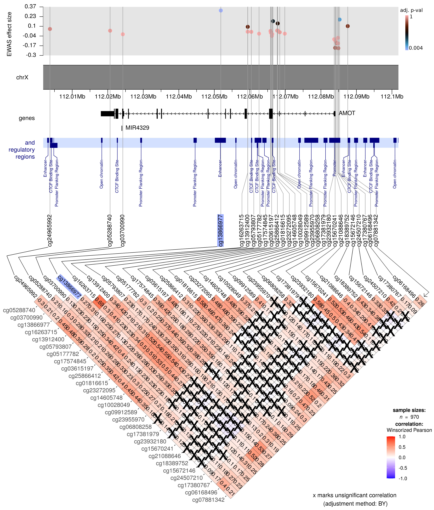

```{r knitr_setup, include=FALSE}
options(htmltools.dir.version = FALSE)
knitr::opts_chunk$set(
  warning = FALSE,
  message = FALSE,
  echo = FALSE,
  dpi = 150
)
```

```{r data_setup, include=FALSE}
library(fontawesome)
library(tidyverse)
library(patchwork)
# library(karyoploteR) # <- I'm using their functions, but explicitly since
                       # there was some crash of these functions with another pkg
library(sanzo)
library(ggrepel)
library(UpSetR)

signif_pval_thresh <- 0.05
dmr_signif_pval_thresh <- 0.01
dmr_min_n_cpgs <- 3

data_folder <- file.path("/home", "jro049", "Naukowe", "START_project",
                         "X-chrom", "DATA")
source(file.path("/home", "jro049", "Naukowe", "START_project",
                         "X-chrom", "gg_qqplot.R"))

# here are the model names as they appear in the raw data,
#  the order signifies the number of model in the final data presentation
all_model_names <- c("1c", "parents.1c", "1d.bw", "parents.1d.bw")
```

```{r xaringan-themer, include=FALSE, warning=FALSE}
# setting up extra features:
library(xaringanExtra)
use_scribble()
use_fit_screen()

library(xaringanthemer)
style_duo_accent(
  primary_color = "#1381B0",
  secondary_color = "#FF961C",
  inverse_header_color = "#FFFFFF"
)
```

```{r ewas_read_data, echo = FALSE, warning = FALSE}
load(file.path(data_folder, "XchromosomeResults.RData"))
all_res_names <- ls(pattern = "^Both.|^Boys.|^Girls.")
rm(list = all_res_names)

dmrff_res_all <- readRDS(file.path(data_folder, "DMRFF_results_TEXT.rds"))
names(dmrff_res_all) <- all_res_names

ewas_results <- readRDS(file.path(data_folder, "Xchromosome_results_TEXT.rds"))
names(ewas_results) <- all_res_names

# read cpg info
cpg_info <- readRDS(file.path(data_folder, "CpG_info_Xchrom_manifest.rds"))

all_res_names <- all_res_names[-grep(pattern = "^Both.", x = all_res_names)]
dmrff_res_all <- dmrff_res_all[all_res_names]
ewas_results <- ewas_results[all_res_names]

signif_res <- map(all_res_names, function(name){
  return(
    ewas_results[[name]]$results %>%
      tibble::add_column(group = name) %>%
      tidyr::separate(
        col = group,
        into = c("gender", "model_name"),
        sep = "\\.",
        extra = "merge"
      ) %>%
      mutate(model_no = match(model_name, all_model_names)) %>%
      mutate(ps_adj_BH = stats::p.adjust(ps, method = "BH")) %>%
      mutate(signif = (ps_adj_BH < signif_pval_thresh))
  )
}) %>% bind_rows()
```

background-image: url("robbie-down-wEwm7znMIDg-unsplash.jpg")
background-size: cover

class: left, top, inverse

<p style="font-weight: 900; font-family: helvetica; font-size: 3rem; color: yellow; text-shadow: 2px 2px black;">X-chromosome EWAS</p>

<p style="font-weight: 900; font-family: helvetica; font-size: 2.25rem; color: white; text-shadow: 2px 2px black;">what we found this far</p>

<br>
<p style="font-weight: 900; font-family: helvetica; font-size: 2.25rem; color: white; text-shadow: 2px 2px black;">Julia Romanowska</p>


<br>
<p style="font-weight: 900; font-family: helvetica; font-size: 1.5rem; color: white; text-shadow: 2px 2px black;">January 7, 2022</p>


<p style="font-size: 12pt; font-weight: bold; right: 10px; bottom: 20px; color: white; position: absolute; text-shadow: 2px 2px black;"> 
Photo by <a style="color: white;" href="https://unsplash.com/@robbiedown?utm_source=unsplash&utm_medium=referral&utm_content=creditCopyText">Robbie Down</a> on <a style="color: white;" href="https://unsplash.com/?utm_source=unsplash&utm_medium=referral&utm_content=creditCopyText">Unsplash</a>
</p>


---
class: inverse, left, bottom

# OUTLINE

## `r fa("microscope")` Data

## `r fa("laptop-code")` Methods

## `r fa("paint-brush")` Some results

## `r fa("question-circle")` Discussion

---

## `r fa("microscope")` Data

- Boys `r fa("mars")` and girls `r fa("venus")` separately

- **models** and **sample sizes**:

    1. CpG ~ ART + mat_age + smoking + mat_bmi + isPrimiparous

    2. CpG ~ ART + mat_age + smoking + mat_bmi + isPrimiparous + mat_meth + pat_meth

    3. CpG ~ ART + mat_age + smoking + mat_bmi + isPrimiparous + GA + BW

    4. CpG ~ ART + mat_age + smoking + mat_bmi + isPrimiparous + GA + BW + mat_meth + pat_meth

<table style="width:100%">
  <tr>
    <th></th>
    <th colspan="2" style="border-left: 1px solid black;">Model 1</th>
    <th colspan="2" style="border-left: 1px solid black;">Model 2</th>
    <th colspan="2" style="border-left: 1px solid black;">Model 3</th>
    <th colspan="2" style="border-left: 1px solid black;">Model 4</th>
  </tr>
  <tr style="font-weight: bold; text-align: center;">
    <td></td>
    <td>ART</td>
    <td>control</td>
    <td>ART</td>
    <td>control</td>
    <td>ART</td>
    <td>control</td>
    <td>ART</td>
    <td>control</td>
  </tr>
  <tr style="text-align: center;">
    <td></td>
    <td>495</td>
    <td>463</td>
    <td>488</td>
    <td>456</td>
    <td>494</td>
    <td>461</td>
    <td>487</td>
    <td>454</td>
  </tr>
  <tr style="text-align: center;">
    <td></td>
    <td>446</td>
    <td>503</td>
    <td>440</td>
    <td>495</td>
    <td>446</td>
    <td>501</td>
    <td>440</td>
    <td>493</td>
  </tr>
</table>

???

The main models we're discussing in the paper are Models 1 & 2, while Models 
3 & 4 are mainly in the Supplementary.

Models 3 & 4 expand models 1 & 2 by adjusting also for gestational age &
birth weight; models 3 & 4 expand models 1 & 2, respectively, by adjusting
also for parental DNAm.

We saw that the most significant results were very similar in all the models,
specifically, adding adjustment for GA and BW did not change the outcome.

---

## `r fa("laptop-code")` Methods

- linear regression

- **BACON** - to remove bias in p-values

- **DMRff** - to check for *differentially methylated regions*

- **ggcorrplot** to calculate and visualize *correlation of DNAm*

- **karyoploteR** & **biomaRt** - to visualize location of hits

???

Haakon Nustad did lot of work. Julia Romanowska did post-processing, bioinformatics
analyses, and plotting.

---

## EWAS

```{r ewas_bacon, out.width='80%', out.extra="style = 'position: absolute; top: 40px;'", dev.args = list(bg = 'transparent'), fig.align = "center"}
my_colors <- sanzo.quad("c279")

all_pvals <- signif_res$ps
names(all_pvals) <- paste0(signif_res$gender, "_model", signif_res$model_no)

pvals_qqplot <- create_df_qq(all_pvals) %>%
  select(-group) %>%
  bind_cols(
    signif_res %>%
      arrange(gender, model_no, ps) %>%
      select(gender, model_no, cpg_id)
  )

log10Pe <- expression(paste("Expected -log"[10], plain(P)))
log10Po <- expression(paste("Observed -log"[10], plain(P)))
max.lims <- range(c(pvals_qqplot$observed, pvals_qqplot$expected)) + 0.5

ggplot(pvals_qqplot) +
  geom_point(aes(expected, observed, color = as.factor(model_no))) +
  scico::scale_color_scico_d(palette = "berlin", name = "model no.") +
  facet_wrap(facets = vars(gender)) +
  geom_abline(intercept = 0, slope = 1, alpha = 0.5) +
  geom_line(aes(expected, cupper), linetype = 2) +
  geom_line(aes(expected, clower), linetype = 2) +
  # showing labels only for the two most signif.CpGs - these are the
    #  same across models for girls-only and boys-only groups
  geom_label_repel(
    aes(expected, observed, label = cpg_id),
    color = "grey30",
    data = pvals_qqplot %>%
      filter(model_no == 1) %>%
      group_by(gender, model_no) %>%
      slice(1:2),
    xlim = c(5, NA),
    force = 100#,
    # max.iter = 100000
  ) +
  xlab(log10Pe) +
  ylab(log10Po) +
  ylim(0, round(max.lims[2])) +
  xlim(0, round(max.lims[2])) +
  coord_fixed(clip = FALSE) +
  theme(legend.position = "bottom")
```

???

There were no big difference in the most significant findings across the models.

In the boys-only analyses, there were mainly 3 CpGs, with 2 extra being
significant in model 1.

In the girls-only analyses, there were the same 6 significant CpGs in _all_
the models.

---

**Significant CpGs** &nbsp;&nbsp;&nbsp; *significant if FDR < 0.05*

```{r ewas_signif_locations, out.width='65%', out.extra="style = 'position: absolute; top: 80px; left: 100px'", dev.args = list(bg = 'transparent'), fig.align = "center"}
# gathering results to plot - only model 1
signif_res_4plotting <- signif_res %>%
  filter(model_no == 1) %>%
  select(-starts_with("old")) %>%
  left_join(
    cpg_info %>%
      select(Name, CHR, MAPINFO),
    by = c("cpg_id" = "Name")
  )

chr <- "X"

# read in regulatory regions found for any of the significant hits
regulatory_regs <- readRDS(file.path(data_folder, "regulatory_regions.rds"))
plot_regulatory_reg <- GenomicRanges::makeGRangesFromDataFrame(
  as.data.frame(
    regulatory_regs[c("Boys.1c", "Girls.1c")] %>%
      bind_rows() %>%
      distinct() %>%
      arrange(chromosome_start) %>%
      mutate(seqnames = paste0("chr", chr)) %>%
      dplyr::select(
        seqnames, start = chromosome_start, end = chromosome_end,
        everything()
      ) %>%
      dplyr::select(-chromosome_name)
  ),
  keep.extra.columns = TRUE,
  ignore.strand = TRUE
)

# read in gene region info
genes_regs <- readRDS(file.path(data_folder, "genes_regions.rds"))
plot_data_genes <- GenomicRanges::makeGRangesFromDataFrame(
  as.data.frame(
    genes_regs[c("Boys.1c", "Girls.1c")] %>%
      bind_rows() %>%
      distinct() %>%
      arrange(start_position) %>%
      mutate(seqnames = paste0("chr", chr)) %>%
      dplyr::select(seqnames, start = start_position, end = end_position, everything())
  ),
  keep.extra.columns = TRUE,
  ignore.strand = TRUE
)

# PLOTTING
pp <- karyoploteR::getDefaultPlotParams(plot.type = 2)
pp$topmargin <- 1
pp$bottommargin <- 10
pp$data1height <- 200
pp$leftmargin <- 0.15
pp$rightmargin <- 0.05
pp$ideogramheight <- 20

kp <- karyoploteR::plotKaryotype(
  chromosomes = paste0("chr", chr),
  plot.type = 2,
  plot.params = pp
)
# generating gene density
txdb <- TxDb.Hsapiens.UCSC.hg19.knownGene::TxDb.Hsapiens.UCSC.hg19.knownGene
all.genes <- suppressMessages(
  karyoploteR::makeGenesDataFromTxDb(
    txdb,
    kp,
    plot.transcripts = FALSE,
    plot.transcripts.structure = FALSE)
  )$genes
all.genes.tbl <- as_tibble(as.data.frame(all.genes))

# plotting gene density
karyoploteR::kpPlotDensity(
  kp, all.genes,
  data.panel = 2,
  r0 = 0, r1 = 0.3
)
karyoploteR::kpAddLabels(
  kp, labels = "gene density",
  data.panel = 2,
  r0 = 0, r1 = 0.2,
  label.margin = -0.02
)
# plotting CpG p-values
# girls:
cur_data_signif <- signif_res_4plotting %>%
  filter(gender == "Girls") %>%
  filter(signif)
cur_data_all <- signif_res_4plotting %>%
  filter(gender == "Girls")
cur_y_range <- range(-log10(cur_data_all$ps_adj_BH))
karyoploteR::kpPoints(
  kp,
  x = cur_data_signif$MAPINFO,
  y = -log10(cur_data_signif$ps_adj_BH),
  chr = paste0("chr", chr),
  data.panel = 1,
  cex = 1.5,
  col = "#FB17FF",
  r0 = 0,
  r1 = 0.4,
  ymin = cur_y_range[1],
  ymax = cur_y_range[2]
)
karyoploteR::kpPoints(
  kp,
  x = cur_data_all$MAPINFO,
  y = -log10(cur_data_all$ps_adj_BH),
  chr = paste0("chr", chr),
  data.panel = 1,
  r0 = 0,
  r1 = 0.4,
  ymin = cur_y_range[1],
  ymax = cur_y_range[2]
)
karyoploteR::kpAxis(
  kp,
  data.panel = 1,
  r0 = 0,
  r1 = 0.4,
  ymin = cur_y_range[1],
  ymax = cur_y_range[2]
)
karyoploteR::kpAddLabels(
  kp, labels = "-log10(P)",
  srt = 90, data.panel = 1,
  r0 = 0.35, r1 = 0.4,
  label.margin = 0.09
)
karyoploteR::kpAddLabels(
  kp, labels = "GIRLS",
  data.panel = 1,
  r0 = 0.4, r1 = 0.45,
  label.margin = -0.4
)
# boys:
cur_data_signif <- signif_res_4plotting %>%
  filter(gender == "Boys") %>%
  filter(signif)
cur_data_all <- signif_res_4plotting %>%
  filter(gender == "Boys")
cur_y_range <- range(-log10(cur_data_all$ps_adj_BH))
karyoploteR::kpPoints(
  kp,
  x = cur_data_signif$MAPINFO,
  y = -log10(cur_data_signif$ps_adj_BH),
  chr = paste0("chr", chr),
  data.panel = 1,
  cex = 1.5,
  col = "#13DCFF",
  r0 = 0.55,
  r1 = 0.95,
  ymin = cur_y_range[1],
  ymax = cur_y_range[2]
)
karyoploteR::kpPoints(
  kp,
  x = cur_data_all$MAPINFO,
  y = -log10(cur_data_all$ps_adj_BH),
  chr = paste0("chr", chr),
  data.panel = 1,
  r0 = 0.55,
  r1 = 0.95,
  ymin = cur_y_range[1],
  ymax = cur_y_range[2]
)
karyoploteR::kpAxis(
  kp,
  data.panel = 1,
  r0 = 0.55,
  r1 = 0.95,
  ymin = cur_y_range[1],
  ymax = cur_y_range[2]
)
karyoploteR::kpAddLabels(
  kp, labels = "-log10(P)",
  srt = 90, data.panel = 1,
  r0 = 0.85, r1 = 0.95,
  label.margin = 0.09
)
karyoploteR::kpAddLabels(
  kp, labels = "BOYS",
  data.panel = 1,
  r0 = 1, r1 = 1.05,
  label.margin = -0.4
)

# plotting regulatory regs
cur_reg_regs <- plot_regulatory_reg
if(length(cur_reg_regs) != 0){
  karyoploteR::kpDataBackground(
    kp, data.panel = 2,
    r0 = 0.55,
    r1 = 0.65,
    color = "#D3E1FF"
  )
  karyoploteR::kpPlotRegions(
    kp, data = cur_reg_regs,
    data.panel = 2, r0 = 0.55, r1 = 0.65,
    col = "navyblue",
    border = "navyblue"
  )
  karyoploteR::kpPlotMarkers(
    kp, data = cur_reg_regs,
    labels = cur_reg_regs$feature_type_name,
    data.panel = 2, r0 = 0, r1 = 1,
    # text.orientation = "horizontal",
    # offset = 0.5,
    # pos = 2,
    label.color = "navyblue",
    line.color = "navyblue",
    ignore.chromosome.ends = TRUE
  )
  karyoploteR::kpAddLabels(
    kp, labels = "regulatory\n regions",
    data.panel = 2, r0 = 0.6, r1 = 0.7,
    col = "navyblue"
  )
}

# plotting genes
karyoploteR::kpDataBackground(
  kp, data.panel = 2,
  r0 = 0.35,
  r1 = 0.45,
  color = "grey90"
)
karyoploteR::kpPlotMarkers(
  kp, data = plot_data_genes,
  labels = plot_data_genes$external_gene_name,
  data.panel = 2, r0 = 0, r1 = 0.55,
  text.orientation = "horizontal",
  label.dist = 0.01,
  label.margin = 1,
  line.color = "gray60",
  ignore.chromosome.ends = TRUE
)
karyoploteR::kpAddLabels(
  kp, labels = "genes",
  data.panel = 2, r0 = 0.35, r1 = 0.4
)
```

???

The significant CpGs were very similar in between the models - both effect size
and FDR-adjusted p-values did not change much.

There are no CpGs that are common among boys and girls, not even if we consider
genomic regions.

---

**DMRs** &nbsp;&nbsp;&nbsp; *significant if FDR < 0.01 and \#CpGs >= 3*

```{r plot_DMRs_positions, out.width='65%', out.extra="style = 'position: absolute; top: 80px; left: 100px'", dev.args = list(bg = 'transparent'), fig.align = "center"}
# gathering results to plot - only model 1
signif_DMR_4plotting <- map(
  c("Boys.1c", "Girls.1c"),
  function(x){
    dmrff_res_all[[x]] %>%
      tibble::add_column(model = x) %>%
      select(-B, -S) %>%
      mutate(signif = ((p.adjust < dmr_signif_pval_thresh) &
                         n >= dmr_min_n_cpgs))
  }) %>%
  bind_rows() %>%
  separate(
    col = model, into = c("gender", "model_name"), sep = "\\.", extra = "merge"
  )

returnNonOverlaps <- function(x, y){
  # x, y - GRanges
  which_overlap <- GenomicRanges::findOverlaps(x, y, select = "last", ignore.strand = TRUE)
  if(!all(is.na(which_overlap))){ # some overlaps found
    which_overlap <- na.omit(which_overlap)
    y <- y[-which_overlap]
  }
  return(
    GenomicRanges::sort(c(x, y))
  )
}

# read in gene region info
dmr_genes_regs <- readRDS(file.path(data_folder, "DMR_genes.rds"))
chosen_dmr_genes_regs <- dmr_genes_regs[c("Boys.1c", "Girls.1c")]
 # concatenating GRanges is only possible when the list is not named!
names(chosen_dmr_genes_regs) <- NULL
plot_dmr_data_genes <- Reduce(
  returnNonOverlaps,
  unlist(
    map(chosen_dmr_genes_regs, function(y){
      map(y, function(z){
        pluck(z, "genes")
      })
    })
  )
)

# read in regulatory regions found for any of the significant hits
dmr_regulatory_regs <- readRDS(file.path(data_folder, "DMR_regul_regs.rds"))
plot_dmr_regulatory_reg <- dmr_regulatory_regs[c("Boys.1c", "Girls.1c")]
names(plot_dmr_regulatory_reg) <- NULL
plot_dmr_regulatory_reg <- Reduce(
  returnNonOverlaps, plot_dmr_regulatory_reg
)
# shortening the type name to fit on the plot
plot_dmr_regulatory_reg$type <- str_replace(
  string = plot_dmr_regulatory_reg$type,
  pattern = "CTCF Binding Site",
  replacement = "CTCF b.site"
)
  

# PLOTTING
pp <- karyoploteR::getDefaultPlotParams(plot.type = 2)
pp$topmargin <- 1
pp$bottommargin <- 10
pp$data1height <- 200
pp$leftmargin <- 0.15
pp$rightmargin <- 0.05
pp$ideogramheight <- 20

kp <- karyoploteR::plotKaryotype(
  chromosomes = paste0("chr", chr),
  plot.type = 2,
  plot.params = pp
)
# plotting gene density
karyoploteR::kpPlotDensity(
  kp, all.genes,
  data.panel = 2,
  r0 = 0, r1 = 0.3
)
karyoploteR::kpAddLabels(
  kp, labels = "gene density",
  data.panel = 2,
  r0 = 0, r1 = 0.2,
  label.margin = -0.02
)
# plotting CpG p-values
# girls:
cur_data_signif <- signif_DMR_4plotting %>%
  filter(gender == "Girls") %>%
  filter(signif) %>%
  arrange(start)
cur_data_all <- signif_DMR_4plotting %>%
  filter(gender == "Girls") %>%
  arrange(start)
cur_y_range <- range(-log10(cur_data_all$p.adjust))
karyoploteR::kpPoints(
  kp,
  x = cur_data_signif$start,
  y = -log10(cur_data_signif$p.adjust),
  chr = paste0("chr", chr),
  data.panel = 1,
  cex = 1.5,
  col = "#FB17FF",
  r0 = 0,
  r1 = 0.4,
  ymin = cur_y_range[1],
  ymax = cur_y_range[2]
)
karyoploteR::kpPoints(
  kp,
  x = cur_data_all$start,
  y = -log10(cur_data_all$p.adjust),
  chr = paste0("chr", chr),
  data.panel = 1,
  r0 = 0,
  r1 = 0.4,
  ymin = cur_y_range[1],
  ymax = cur_y_range[2]
)
karyoploteR::kpAxis(
  kp,
  data.panel = 1,
  r0 = 0,
  r1 = 0.4,
  ymin = cur_y_range[1],
  ymax = cur_y_range[2]
)
karyoploteR::kpAddLabels(
  kp, labels = "-log10(P)",
  srt = 90, data.panel = 1,
  r0 = 0.35, r1 = 0.4,
  label.margin = 0.1
)
karyoploteR::kpAddLabels(
  kp, labels = "GIRLS",
  data.panel = 1,
  r0 = 0.4, r1 = 0.45,
  label.margin = -0.4
)
# boys:
cur_data_signif <- signif_DMR_4plotting %>%
  filter(gender == "Boys") %>%
  filter(signif) %>%
  arrange(start)
cur_data_all <- signif_DMR_4plotting %>%
  filter(gender == "Boys") %>%
  arrange(start)
cur_y_range <- range(-log10(cur_data_all$p.adjust))
karyoploteR::kpPoints(
  kp,
  x = cur_data_signif$start,
  y = -log10(cur_data_signif$p.adjust),
  chr = paste0("chr", chr),
  data.panel = 1,
  cex = 1.5,
  col = "#13DCFF",
  r0 = 0.55,
  r1 = 0.95,
  ymin = cur_y_range[1],
  ymax = cur_y_range[2]
)
karyoploteR::kpPoints(
  kp,
  x = cur_data_all$start,
  y = -log10(cur_data_all$p.adjust),
  chr = paste0("chr", chr),
  data.panel = 1,
  r0 = 0.55,
  r1 = 0.95,
  ymin = cur_y_range[1],
  ymax = cur_y_range[2]
)
karyoploteR::kpAxis(
  kp,
  data.panel = 1,
  r0 = 0.55,
  r1 = 0.95,
  ymin = cur_y_range[1],
  ymax = cur_y_range[2]
)
karyoploteR::kpAddLabels(
  kp, labels = "-log10(P)",
  srt = 90, data.panel = 1,
  r0 = 0.85, r1 = 0.95,
  label.margin = 0.1
)
karyoploteR::kpAddLabels(
  kp, labels = "BOYS",
  data.panel = 1,
  r0 = 0.95, r1 = 1.05,
  label.margin = -0.4
)

# plotting regulatory regs
if(length(plot_dmr_regulatory_reg) != 0){
  karyoploteR::kpDataBackground(
    kp, data.panel = 2,
    r0 = 0.55,
    r1 = 0.65,
    color = "#D3E1FF"
  )
  karyoploteR::kpPlotRegions(
    kp, data = plot_dmr_regulatory_reg,
    data.panel = 2, r0 = 0.55, r1 = 0.65,
    col = "navyblue",
    border = "navyblue"
  )
  karyoploteR::kpPlotMarkers(
    kp, data = plot_dmr_regulatory_reg,
    labels = plot_dmr_regulatory_reg$type,
    data.panel = 2, r0 = 0, r1 = 1,
    # text.orientation = "horizontal",
    # offset = 0.5,
    # pos = 2,
    label.color = "navyblue",
    line.color = "navyblue",
    ignore.chromosome.ends = TRUE
  )
  karyoploteR::kpAddLabels(
    kp, labels = "regulatory\n regions",
    data.panel = 2, r0 = 0.6, r1 = 0.7,
    col = "navyblue"
  )
}

# plotting genes
karyoploteR::kpDataBackground(
  kp, data.panel = 2,
  r0 = 0.35,
  r1 = 0.45,
  color = "grey90"
)
karyoploteR::kpPlotMarkers(
  kp, data = plot_dmr_data_genes,
  labels = plot_dmr_data_genes$name,
  data.panel = 2, r0 = 0, r1 = 0.55,
  # text.orientation = "horizontal",
  label.dist = 0.01,
  label.margin = 1,
  pos = 2,
  offset = 0.05,
  cex = 0.7,
  lwd = 1.5,
  line.color = "gray60",
  ignore.chromosome.ends = TRUE,
  clipping = FALSE
)
karyoploteR::kpAddLabels(
  kp, labels = "genes",
  data.panel = 2, r0 = 0.35, r1 = 0.4
)

```

???

We've found also many DMRs - interestingly more among girls than boys.

Vast majority of the DMRs overlapped with promoter regions; several were co-located
with CTCF (an ubiquitous TF) binding site; and only in two cases the DMR was
within a gene body.

---

**Co-methylation patterns**

**Boys, near two most significant CpGs**


???

And now, for something really cool!

Co-methylation patterns around the significant EWAS findings.

Example plot - boys-only analyses showed two CpGs that were most significant
across all the models. These two are very near each other, only several bp
away, so it's actually good to see that they are both picked up in our
analyses. We also see that their DNAm levels are very highly correlated with
each other and there is a small cluster of CpGs around those. These were
picked up in the DMRff analyses.

This DMR is within a short gene, _UBE2DNL_. This gene is transcribed to a protein,
but its function is not known. Intriguingly, UBE2DNL protein is an enzyme that
lacks a crucial cytosine in its active site, thus it is probably inactive.
We know, however, that it's expressed almost only in testis.


---

<!-- ## Co-methylation patterns -->
**Girls, near cg13866977**



???

There were two equally significant results in the girls-only EWA calculations: cg25034591 and cg13866977. The last one being within a regulatory region and, at the same time, within an intron of angiomotin (AMOT) gene. Interestingly, one of the CpGs (cg13866977 was originally) annotated to a region originally defined as ‘enhancer’ in the GRCh37 genome build but this was changed to ‘promoter flanking region’ in the newer GRCh38 genome build (ensembl regulatory ID ENSR00000912938). It is not unprecedented for the definition and location of annotations to change from one genome version to another. For example, the distinction between promoter and enhancer is not always clear, especially when they have several properties and functions in common, and an update from old definitions might alter the original annotations [REF]. Hence, a more suitable annotation for cg13866977 might have been ‘transcription regulatory element’. Moreover, GeneHancer db (REF) lists this regulatory region as putative enhancer of the AMOT gene (GH ID GH0XJ112807, https://www.genecards.org/cgi-bin/carddisp.pl?gene=AMOT&keywords=AMOT#genomic_location).
This regulatory region is active in only six cell types, one of which is placenta. This is based on the ensembl visualization of experimental data showing various histone markers states and DNase1 activity (http://www.ensembl.org/Homo_sapiens/Regulation/Summary?db=core;fdb=funcgen;r=X:112806973-112809972;rf=ENSR00000912938). According to The Huma Protein Atlas, AMOT protein is mainly expressed in placenta and kidney (https://www.proteinatlas.org/ENSG00000126016-AMOT/tissue), however, AMOT gene is much more transcribed in epididymis (part of the male reproductive system). 
Our data shows that the DNAm level at cg13866977 is almost 1 in boys (i.e., full methylation of the cytosine) and above 0.7 in majority of cases in girls (Figure_AMOT_CpG_methylation). Since DNAm signals are mainly translated to the transcription level, we looked at whether the transcription factors (TFs) that were predicted to bind to cg13866977 have preferrence to bind to the unmethylated or methylated sequence. The JASPAR and MeDReaders (http://medreader.org/browse-tf) databases show that out of seven TFs none were shown to bind to the methylated sequence, thus suggesting that the methylated state of this CpG signalises inactivation of this regulatory region. Moreover, the methylation state is higher for the girls conceived through ART than those conceived naturally (effect size 0.32, Model 1) and does not change much when we adjusted for parental DNAm at this site (effect size 0.33, Model 2). This suggests that the regulatory region within AMOT is less activated after the ART procedure in girls.

---

**Zooming on DMRs...**

```{r zooming_DMR1, out.width='70%', out.extra="style = 'position: absolute; top: 50px; left: 100px'", dev.args = list(bg = 'transparent'), fig.align = "center"}
chosen_genes_zoom <- c("BCAP31", "SRPK3", "ABCD1")
all_genes_dmrs <- do.call(
  c,
  c(
    map(dmr_genes_regs$Boys.1c, pluck, "genes"),
    do.call(
      c,
      map(dmr_genes_regs$Girls.1c, pluck, "genes")
    )
  )
)
zoom_gene <- all_genes_dmrs[
  all_genes_dmrs$name %in% chosen_genes_zoom,
]
margin_zoom <- c(10000, 20000)
zoom_region <- regioneR::toGRanges(
    data.frame(
      chr = "chrX",
      start = min(GenomicRanges::start(zoom_gene)) - margin_zoom[1],
      end = max(GenomicRanges::end(zoom_gene)) + margin_zoom[2]
    )
  )

# find the regulatory regions within the zoomed region
regul_regs_df <- Reduce(
  f = returnNonOverlaps,
  x = dmr_regulatory_regs
)
zoom_regulatory_regs <- as_tibble(
    as.data.frame(regul_regs_df, row.names = NULL)
  ) %>%
  distinct() %>%
  filter(
    (start <= GenomicRanges::end(zoom_region) &
       start >= GenomicRanges::start(zoom_region)) |
    (end >= GenomicRanges::start(zoom_region) &
       end <= GenomicRanges::end(zoom_region))
  )
zoom_regulatory_regs <- GenomicRanges::makeGRangesFromDataFrame(
  zoom_regulatory_regs,
  keep.extra.columns = TRUE
)

# find zoomed DMRs
dmrff_signif_all <- map(
  names(dmrff_res_all),
  function(name){
    return(
      as_tibble(dmrff_res_all[[name]]) %>%
        filter(p.adjust < dmr_signif_pval_thresh & n >= dmr_min_n_cpgs) %>%
        tibble::add_column(group = name)
    )
  }) %>%
  bind_rows()

zoom_dmr_girls <- dmrff_signif_all %>%
  separate(group, into = c("sex", "model_name"), sep = "\\.", extra = "merge") %>%
  filter(sex == "Girls") %>%
  filter(
    (start <= GenomicRanges::end(zoom_region) &
       start >= GenomicRanges::start(zoom_region)) |
    (end >= GenomicRanges::start(zoom_region) &
       end <= GenomicRanges::end(zoom_region))
  )
zoom_dmr_boys <- dmrff_signif_all %>%
  separate(group, into = c("sex", "model_name"), sep = "\\.", extra = "merge") %>%
  filter(sex == "Boys") %>%
  filter(
    (start <= GenomicRanges::end(zoom_region) &
       start >= GenomicRanges::start(zoom_region)) |
    (end >= GenomicRanges::start(zoom_region) &
       end <= GenomicRanges::end(zoom_region))
  )

# plot zoomed region
pp <- karyoploteR::getDefaultPlotParams(plot.type = 2)
pp$topmargin <- 0
pp$bottommargin <- 1
pp$rightmargin <- 0.1
pp$data1height <- 150
pp$data2height <- 300
pp$ideogramheight <- 20

kp_tmp <- karyoploteR::plotKaryotype(
  chromosome = "chrX",
  zoom = zoom_region,
  plot.type = 2,
  plot.params = pp,
  cex = 0.8
)
zoom_genes_data <- karyoploteR::makeGenesDataFromTxDb(
  TxDb.Hsapiens.UCSC.hg19.knownGene::TxDb.Hsapiens.UCSC.hg19.knownGene,
  karyoplot = kp_tmp
)
zoom_genes_data <- karyoploteR::addGeneNames(zoom_genes_data)
zoom_genes_data <- karyoploteR::mergeTranscripts(zoom_genes_data)

# background
karyoploteR::kpDataBackground(
  kp_tmp, data.panel = 2,
  r0 = 0.1, r1 = 0.35,
  color = "#EFFFEF" # pale green
)
karyoploteR::kpDataBackground(
  kp_tmp, data.panel = 2,
  r0 = 0.4, r1 = 0.65,
  color = "#EFFFEF" # pale green
)
karyoploteR::kpDataBackground(
  kp_tmp, data.panel = 2,
  r0 = 0.7, r1 = 0.8,
  color = "#D3E1FF" # pale blue
)

karyoploteR::kpAddBaseNumbers(
  kp_tmp,
  tick.dist = 20000,
  tick.len = 10,
  minor.ticks = TRUE,
  minor.tick.dist = 5000,
  minor.tick.len = 5,
  add.units = TRUE,
  digits = 4,
  cex = 0.8
)
karyoploteR::kpPlotGenes(
  kp_tmp,
  data = zoom_genes_data,
  gene.name.cex = 0.8
)

# plot the DMR
#  - first: girls
walk(seq_along(all_model_names), function(x){
  cur_plot_data <- GenomicRanges::makeGRangesFromDataFrame(
      zoom_dmr_girls %>%
        filter(model_name == all_model_names[x]) %>%
        mutate(seqnames = "chrX", .before = chr) %>%
        dplyr::select(-chr),
      keep.extra.columns = TRUE
    )
  cur_plot_r0 <- (x - 1)*0.06 + 0.11
  cur_plot_r1 <- x*0.06 + 0.09
  karyoploteR::kpPlotRegions(
    kp_tmp,
    data = cur_plot_data,
    data.panel = 2,
    r0 = cur_plot_r0,
    r1 = cur_plot_r1,
    col = "darkgreen",
    border = "darkgreen"
  )
  karyoploteR::kpAddLabels(
    kp_tmp,
    labels = x,
    data.panel = 2,
    label.margin = -15.25,
    side = "right",
    r0 = cur_plot_r0,
    r1 = cur_plot_r1,
    col = "darkgreen",
    cex = 0.8
  )
})
karyoploteR::kpAddLabels(
  kp_tmp,
  labels = "model no.",
  data.panel = 2,
  label.margin = -15.2,
  side = "right",
  r0 = 0.14, r1 = 0.25,
  col = "darkgreen",
  srt = 90,
  pos = 3,
  cex = 0.8
)
karyoploteR::kpAddLabels(
  kp_tmp, labels = "DMRs\n girls-only",
  data.panel = 2,
  label.margin = 0.01,
  r0 = 0.15, r1 = 0.25,
  col = "darkgreen",
  cex = 0.8
)
#  - next: boys
walk(seq_along(all_model_names), function(x){
  cur_plot_data <- GenomicRanges::makeGRangesFromDataFrame(
      zoom_dmr_boys %>%
        filter(model_name == all_model_names[x]) %>%
        mutate(seqnames = "chrX", .before = chr) %>%
        dplyr::select(-chr),
      keep.extra.columns = TRUE
    )
  cur_plot_r0 <- (x - 1)*0.06 + 0.41
  cur_plot_r1 <- x*0.06 + 0.39
  karyoploteR::kpPlotRegions(
    kp_tmp,
    data = cur_plot_data,
    data.panel = 2,
    r0 = cur_plot_r0,
    r1 = cur_plot_r1,
    col = "darkgreen",
    border = "darkgreen"
  )
  karyoploteR::kpAddLabels(
    kp_tmp,
    labels = x,
    data.panel = 2,
    label.margin = -15.25,
    side = "right",
    r0 = cur_plot_r0,
    r1 = cur_plot_r1,
    col = "darkgreen",
    cex = 0.8
  )
})
karyoploteR::kpAddLabels(
  kp_tmp,
  labels = "model no.",
  data.panel = 2,
  label.margin = -15.2,
  side = "right",
  r0 = 0.44, r1 = 0.55,
  col = "darkgreen",
  srt = 90,
  pos = 3,
  cex = 0.8
)
karyoploteR::kpAddLabels(
  kp_tmp, labels = "DMRs\n boys-only",
  data.panel = 2,
  label.margin = 0.01,
  r0 = 0.45, r1 = 0.55,
  col = "darkgreen",
  cex = 0.8
)

# plot the regulatory regions
karyoploteR::kpPlotRegions(
  kp_tmp,
  data = zoom_regulatory_regs,
  data.panel = 2,
  r0 = 0.7,
  r1 = 0.8,
  col = "navyblue",
  border = "navyblue"
)
karyoploteR::kpPlotMarkers(
  kp_tmp,
  data = zoom_regulatory_regs,
  labels = paste0(zoom_regulatory_regs$type, "\n (",
                  zoom_regulatory_regs$reg_ID, ")"),
  data.panel = 2,
  r0 = 0.7,
  r1 = 0.9,
  cex = 0.8,
  text.orientation = "horizontal", clipping = FALSE,
  label.dist = 0.01,
  label.color = "navyblue",
  line.color = "navyblue"#,
  # ignore.chromosome.ends = TRUE
)
karyoploteR::kpAddLabels(
  kp_tmp,
  labels = "regulatory\n regions",
  data.panel = 2,
  r0 = 0.72,
  r1 = 0.8,
  col = "navyblue",
  cex = 0.8
)

```


???

One of the significant DMRs in the girls-only analyses was co-located with a promoter (ensembl ID ENSR00000249590), which according to GeneHancer DB (GH ID GH0XJ153721) is putative promoter or enhancer for nine genes (ABCD1, BCAP31, HSALNG0140785, PNCK, SLC6A8, KRT18P48, PDZD4, HSALNG0140788, and PLXNB3). Six of these genes produce proteins (ABCD1, BCAP31, PNCK, SLC6A8, PDZD4, and PLXNB3) that form a network, according to evidence from text mining and co-expression arrays (STRING DB, https://version-11-5.string-db.org/cgi/network?networkId=bWgRg6ih0nDV). Deletions or duplications of many of these genes were reported to manifest as impairments or diseases, among those autism.
Right next to this DMR, the boys-only analysis showed a significant DMR co-located with a promoter (ensembl ID ENSR00002105690, GH ID GH0XJ153780) of genes SRPK3, PLXNB3, HSALNG0140793, and SSR4. Of these, only HSALNG0140793 is not a protein coding gene, however, the three other genes does not seem to have much in common. STRING DB shows no interactions (https://version-11-5.string-db.org/cgi/network?networkId=bCqD1tk1QVKv) and no common expression tissue (main RNA-expression profiles are: pancreas for SSR4 (https://www.proteinatlas.org/ENSG00000180879-SSR4/tissue), muscle for SRPK3 (https://www.proteinatlas.org/ENSG00000184343-SRPK3/tissue), and brain for PLXNB3 (https://www.proteinatlas.org/ENSG00000198753-PLXNB3/tissue)).

---

background-image: url("yonatan-anugerah-3k0-K12TgLc-unsplash.jpg")
background-size: cover

class: top, center

<p style="font-weight: 600; font-family: helvetica; font-size: 2rem; color: black;">`r fa("question-circle", fill = "black")` Questions?</p>

<p style="font-size: 12pt; left: 10px; bottom: 20px; color: black; position: absolute;"> Photo by <a href="https://unsplash.com/@yonatanugerah?utm_source=unsplash&utm_medium=referral&utm_content=creditCopyText">yonatan anugerah</a> on <a style="color: black;" href="https://unsplash.com/?utm_source=unsplash&utm_medium=referral&utm_content=creditCopyText">Unsplash</a>
</p>

---

<!-- - why are there many more DMRs found in girls-only analyses? -->

**Who wants to be on the author list?**

<div style="float: right; display: inline; font-size: small;">

<p style="font-style: bold;"> LEGEND:</p>

<table style="width: 250px; right: 50px;">
  <tr>
    <th>symbol</th>
    <th style="border-left: 1px solid black;">responsibilities</th>
  </tr>
  <tr>
    <td style="text-align: center;">`r fa("child")`</td><td>playing with data</td>
  </tr>
  <tr>
    <td style="text-align: center;">`r fa("user-md")`</td><td>contribute to discussion; biological expertise</td>
  </tr>
  <tr>
    <td style="text-align: center;">`r fa("user-secret")`</td><td>checking literature, making text shine</td>
  </tr>
  <tr>
    <td style="text-align: center;">`r fa("user-graduate")`</td><td>supervision</td>
  </tr>
  <tr>
    <td style="text-align: center;">`r fa("user-astronaut")`</td><td>suddenly appearing and asking <i>the most to-the-point question</i></td>
  </tr>
  <tr>
    <td style="text-align: center;">`r fa("user-friends")`</td><td>friendly reviewing the bioinf. approach and implementation</td>
  </tr>
</table>

</div>

currently:

- `r fa("child")` *Julia Romanowska*,

- `r fa("child")` *Haakon E. Nustad*,

- `r fa("user-friends")` *Christian M. Page*,

- `r fa("user-friends")` *William R.P. Denault*,

- `r fa("user-friends")` *Jon Bohlin*,

- `r fa("user-friends")` *Yunsung Lee*,

- `r fa("user-md")` *Maria C. Magnus*,

- `r fa("user-astronaut")` *Håkon K. Gjessing*,

- `r fa("user-md")` *Robert Lyle*,

- `r fa("user-graduate")` *Per Magnus*,

- `r fa("user-graduate")` *Siri E. Håberg*,

- `r fa("user-secret")` *Astanand Jugessur*

