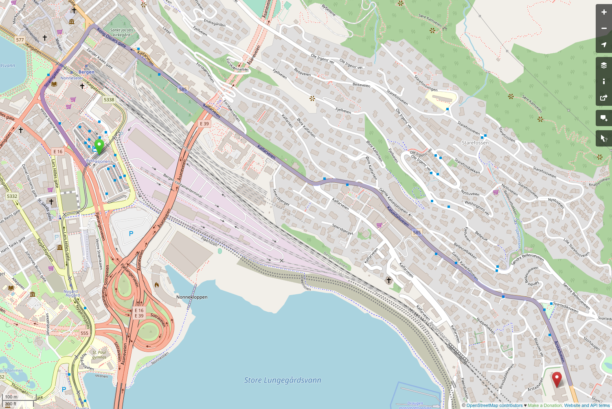
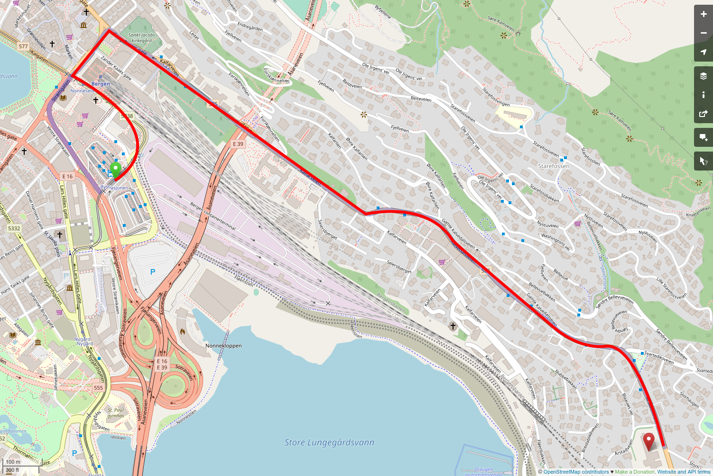

```{r setup, include=FALSE}
options(htmltools.dir.version = FALSE)
library(xaringanthemer)
style_solarized_light()

library(fontawesome)
```

class: centre, top


--

## WHY BOTHER?

---

class: middle, center



---

class: middle, center


---

class: middle, center



---

## It's all about ~~us~~ the data

- if we don't _document, organize, keep track and inform about the changes_:

    - nobody else can help us
    
    - nobody else can continue our work *(bus factor)*
    
    - nobody will trust and use our method or cite our paper
    

---

class: inverse, middle, left

## What should we do?

---

## 1. organize

- good directory structure    
https://slides.djnavarro.net/project-structure

- consistent file naming    
machine readable _and_ human friendly    
[Check this presentation by Jenny Bryan](http://www2.stat.duke.edu/~rcs46/lectures_2015/01-markdown-git/slides/naming-slides/naming-slides.pdf)

- structured datasets
    - `r fa("book-open", fill = "navy")` [How to create good datasets, even in Excel](https://www.tandfonline.com/doi/full/10.1080/00031305.2017.1375989)
    - `r fa("book-open", fill = "navy")` [How to share data with a statistician](https://amstat.tandfonline.com/doi/full/10.1080/00031305.2017.1375987)

---

## 2. document

- `README` files are essential

- maintain a change log

- comment the code/scripts

    - if using R, `Rmarkdown` is highly recommended!

- keep digital notebook/blog

---

## 3. track changes

- with 1. and 2. tracking changes is easy

- and/or use `git`

---

## 4. share information

- don't just dump the data

- **meta-data** is just as important
    - http://goodtables.io/ - checking data
    - `r fa("book-open", fill = "navy")` [what is 'good data'?](https://frictionlessdata.io/introduction/)
    - https://create.frictionlessdata.io/ - app to help annotate datasets

---

background-image: url("johannes-plenio-sPt5RIjKfpk-unsplash.jpg")
background-size: cover

Photo by <a href="https://unsplash.com/@jplenio?utm_source=unsplash&utm_medium=referral&utm_content=creditCopyText">Johannes Plenio</a> on <a href="https://unsplash.com/collections/11649432/landscape?utm_source=unsplash&utm_medium=referral&utm_content=creditCopyText">Unsplash</a>
